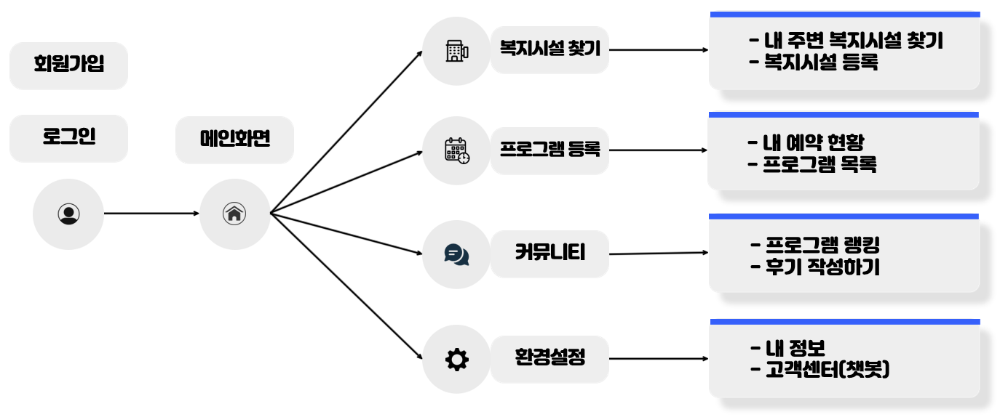
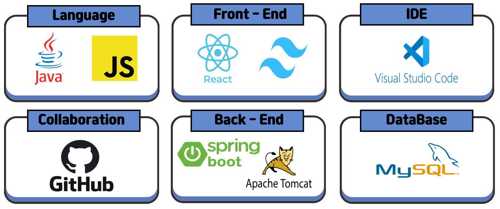
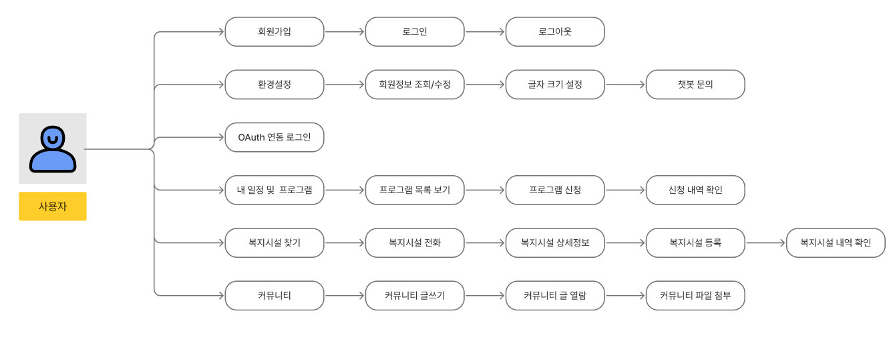
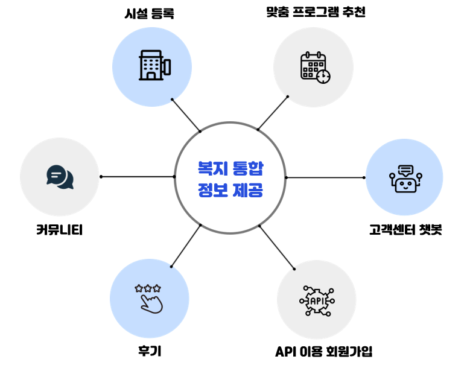
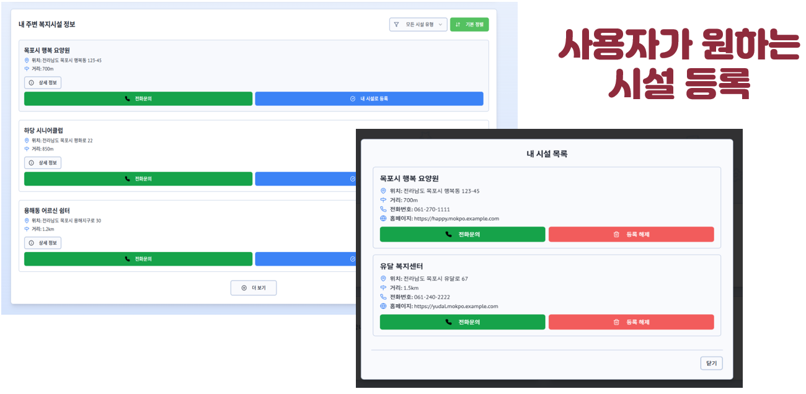
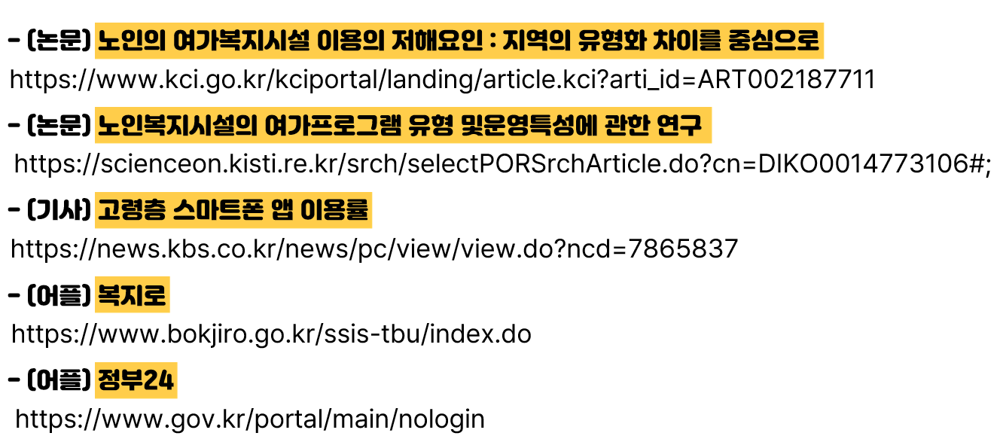

# 팀명 : 실버브릿지

# 1. 프로젝트 개요
주제 : 공공데이터 및 Open AI 기반 고령자 복지 정보 통합 서비스
- 개인 맞춤형 복지 프로그램을 추천하는 서비스 제공
- 모바일 앱 기반의 실시간 정보를 통합 기능 제공
- 고령층 전용 UI/UX를 설계하여 쉽고 편한 서비스 제공
- 커뮤니티 기능을 탑재하여 소통을 증진

---

## 2. 주요 기능
## 개발목표
- 본인에게 맞는 복지 프로그램을 도와주는 웹/앱 구현
- 프로그램 후기를 볼 수 있는 랭킹 시스템이 도입된 커뮤니티 서비스 구현

## 개발내용

---

## 3. 개발환경

---

## 4. 유스케이스

---

## 5. 서비스 아키텍처

---

## 6. ER 다이어그램

---

## 7. 모델 구현

---

## 8. WEB/앱 

## 복지시설 찾기 및 등록:  

## 내 일정 및 프로그램:  

## 프로그램 랭킹 및 후기 작성하기:  

## 고객센터(챗봇):  

---

## 9. 모델개발 트러블 슈팅

## 첫번째 시안
### - Python에서 데이터를 가져와 STS에서 출력하는 과정에서 이미지가 깨지고 데이터를 출력하는데 어려움을 겪음  
  ### → 데이터를 DB에 저장후 STS에서 불러오는 방식으로 변경하였더니 정상 출력됨.

## 두번째 시안
### - API로 지도를 가져와서 마커는 찍는 과정에서 지정한 위치에 마커가 마우스 "클릭" 버튼으로 마커가 이동되는 오류가 발생  
  ### → 위치 설정 코드 및 위도/경도 부분을 수정하여 해결됨.

---

## 10. 팀원역할

---

## 11. 시연영상
https://github.com/user-attachments/assets/1cfda77c-8faa-4cb4-b9a7-9ef625f23242

---

## 12. 참고문헌

